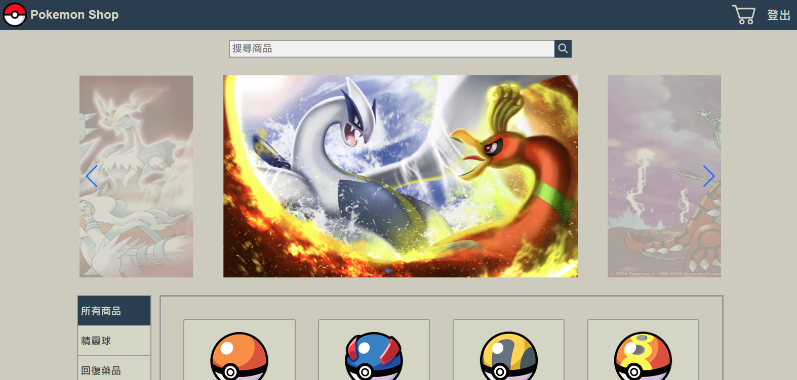

# Pokemon Shop 電商網站

## Demo

https://chengfive.github.io/pokemon-shop/

### 簡介

- 使用以 Vue CLI 4 為開發環境所完成的 SPA 電商網站
- 使用 Vue Router 管理路由
- 使用 Vuex 作為狀態儲存的容器
- 使用 Heroku 建立後端資料(商品資訊、訂單、優惠碼、使用者購物車)進行串接 
  (https://pokemon-shop-server.herokuapp.com/)  
  
- 使用 localStorage 儲存使用者登入狀態

### 主要功能

- 商品分類清單
- 商品詳細資訊展示
- 商品圖片延遲載入以加快網頁載入速度
- 商品查詢
- 商品分頁器
- 首頁廣告輪播
- 等待載入時的遮罩效果與動畫
- 訂單與結帳
- 購物車
- 優惠碼折價
- 登入與登出
- 適應不同解析度的版面配置

### 使用技術

- Vue CLI 4
- Vue Router
- Vuex
- vue3-lazy
- swiper
- axios
- SCSS
- RWD

### 圖片來源
- google圖片(本網站為練習作品，圖片如有侵權麻煩告知，必會立刻刪除。)
